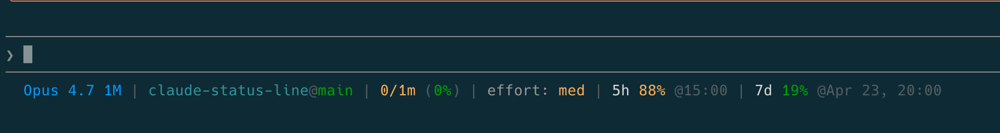

# Claude Code Status Line

A custom status line for [Claude Code](https://claude.com/claude-code) that displays model info, token usage, rate limits, and reset times in a single compact line. It runs as an external shell command, so it does not slow down Claude Code or consume any extra tokens.

## Screenshot

## What it shows

| Segment | Description |
|---------|-------------|
| **Model** | Current model name (e.g., Opus 4.6) |
| **CWD@Branch** | Current folder name, git branch, and file changes (+/-) |
| **Tokens** | Used / total context window tokens (% used) |
| **Effort** | Reasoning effort level (low, med, high) |
| **5h** | 5-hour rate limit usage percentage and reset time |
| **7d** | 7-day rate limit usage percentage and reset time |
| **Extra** | Extra usage credits spent / limit (if enabled) |
| **Update** | Clickable link when a new version is available (checked every 24h) |

Usage percentages are color-coded: green (<50%) → yellow (≥50%) → orange (≥70%) → red (≥90%).

## Requirements

- `jq` — for JSON parsing
- `curl` — for fetching usage data from the Anthropic API
- Claude Code with OAuth authentication (Pro/Max subscription)

## Installation

Paste this prompt into Claude Code:

> Fetch https://raw.githubusercontent.com/haukurk/claude-status-line/main/statusline.sh and use it as my status bar.

Claude Code will download the script, save it to your Claude config directory, and update `settings.json` for you.

## Caching

Usage data from the Anthropic API is cached for 60 seconds at `/tmp/claude/statusline-usage-cache-<hash>.json` to avoid excessive API calls. The cache is shared across all Claude Code instances using the same config directory.

## Update Notifications

The status line checks GitHub for new releases once every 24 hours. When a newer version is available, a second line appears below the status line showing the new version and a link to the repository. The check is cached at `/tmp/claude/statusline-version-cache.json` and fails silently if the API is unreachable or no release has been published.

## How to Update

When the status line shows an update is available, paste this prompt into Claude Code:

> Fetch https://raw.githubusercontent.com/haukurk/claude-status-line/main/statusline.sh and use it as my status bar.

Claude Code will replace the script and restart the status line automatically.

## License

MIT
